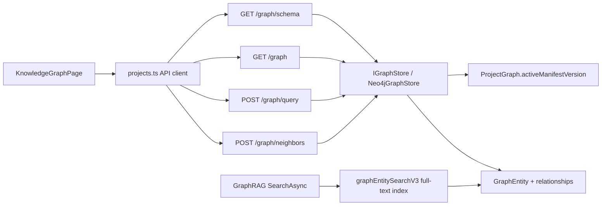
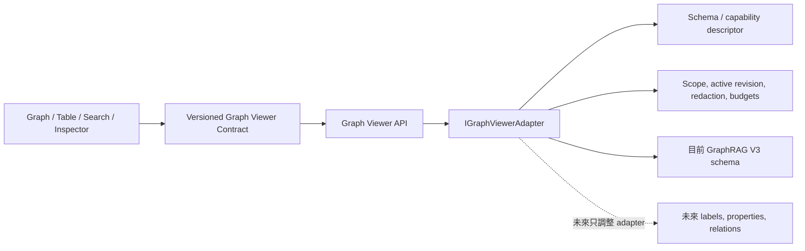

# 知識圖譜查詢與瀏覽功能研究

> 日期：2026-07-31  
> 範圍：Modern Wingman「查看知識圖譜」頁面、對應 REST API、Neo4j V3 visual/query/search 實作與測試。  
> 本文件只做現況稽核與實作規劃，不修改產品程式碼。

## 結論摘要

目前功能的底層架構並不差：它有 active graph version 隔離、關係優先的 bounded sampling、節點／關係分類、鄰居展開、Graph／Table／Raw、PNG／JSON 匯出，以及受限 Cypher 查詢。後端甚至已建立 Neo4j full-text index，GraphRAG 問答也已使用它。

但「一般使用者搜尋與查看」尚未完善，使用者提出的核心問題成立：

1. 上方「搜尋節點」只搜尋瀏覽器目前載入的 1,000／2,000／5,000 個節點，沒有查詢 Neo4j；不在取樣子圖中的節點必然找不到。
2. 搜尋只回第一個命中，沒有結果清單、分頁、分數或條件組合，也不能搜尋關係。
3. `Table` 並不是目前圖譜的表格檢視；未執行 Cypher 時只會顯示空表。
4. 關係類型篩選只完整限制 edge 與「優先核心」；剩餘 node 額度仍可能補入與該關係無關的孤立節點，統計數也沒有套用關係條件。
5. Cypher 編輯器確實可以執行語法，但容易用錯、錯誤訊息缺乏引導；目前 read-only 驗證不只漏掉 Neo4j 5.18 的寫入語法 `INSERT`，專案隔離也只做文字包含檢查，還不能視為可靠的安全邊界。
6. 1,000／2,000／5,000 應被定義成「畫布顯示預算」，不能兼任搜尋範圍。全域搜尋應永遠查 active graph，不受畫布預算限制。

此外，目前 View 並不是 schema-independent：前端 DTO、caption、搜尋與 Inspector 固定認識 `kind`、`role`、`name`、`filePath`，後端 visual DTO、facet、Neo4j mapping、relationship 白名單與 Cypher validator 也直接綁定 V3。若下一版改用不同 label、屬性名稱或 relationship type，現在的 View 必須同步修改。

因此，第一個架構工作應是在「實體知識圖譜 schema」與「通用瀏覽器」之間加入穩定的 **Graph Viewer Contract**，由可替換的 adapter 把目前 V3 或未來 schema 正規化成通用 node／edge／facet／search DTO。View 只依賴這份 contract；未來圖譜 schema 改版時，只修改 adapter 與 descriptor，不修改 Graph／Table／Search／Inspector UI。這個目標不等於取消 active graph、資料去敏感或 bounded response 等必要規則，而是把這些規則集中在 contract 邊界。

建議不要用「提高到載入全部節點」解決搜尋。第一版先建立 Viewer Contract 與 V3 adapter，再完成：修補 Cypher 安全缺口、增加全域節點搜尋 API 與結果清單、點擊結果載入該節點的一階鄰域、修正 Table 與關係篩選語意，最後把節點顯示級距改為依實際總數產生。暫不加入向量搜尋、完整 Cypher IDE、儲存查詢或 relationship evidence 全文索引。

## 一、目前架構



### 1. 前端頁面

`KnowledgeGraphPage` 是整頁元件，集中管理 schema、graph、query result、選取項目、篩選條件、顯示上限與三種 view。[KnowledgeGraphPage.tsx:268](../apps/desktop/src/features/projects/components/KnowledgeGraphPage.tsx#L268)

主要資料流：

- 初始化讀取 `/graph/schema`，取得節點／關係總數及 facets。[KnowledgeGraphPage.tsx:357](../apps/desktop/src/features/projects/components/KnowledgeGraphPage.tsx#L357)
- 讀取 `/graph?limit=&kinds=&relations=`，條件變更便重新查詢。[KnowledgeGraphPage.tsx:293](../apps/desktop/src/features/projects/components/KnowledgeGraphPage.tsx#L293)
- 執行 Cypher 後，以查詢結果完全替換畫布內容。[KnowledgeGraphPage.tsx:437](../apps/desktop/src/features/projects/components/KnowledgeGraphPage.tsx#L437)
- 點選節點後可用 `/graph/neighbors` 取得全部／傳入／傳出／同檔案節點並合併到目前畫布。[KnowledgeGraphPage.tsx:460](../apps/desktop/src/features/projects/components/KnowledgeGraphPage.tsx#L460)
- 以 request generation 防止較舊的非同步回應覆蓋較新的畫面，這項競態處理合理。[KnowledgeGraphPage.tsx:293](../apps/desktop/src/features/projects/components/KnowledgeGraphPage.tsx#L293)

API client 統一使用 120 秒 timeout，並把後端 error body 轉成 UI 訊息。[projects.ts:282](../apps/desktop/src/services/agent-api/projects.ts#L282)

### 2. REST API

目前有四個知識圖譜瀏覽端點：[ProjectEndpoints.cs:73](../apps/agent-service/src/Host/RestEndpoints/ProjectEndpoints.cs#L73)

| Endpoint | 用途 |
|---|---|
| `GET /api/projects/{id}/graph/schema` | 全域節點／關係數、kind 與 relationship type facets |
| `GET /api/projects/{id}/graph` | 取得有界可視化子圖 |
| `POST /api/projects/{id}/graph/query` | 執行受限 read-only Cypher |
| `POST /api/projects/{id}/graph/neighbors` | 從指定節點展開鄰域 |

每個端點都先驗證專案存在、SQLite manifest 與 Neo4j active manifest 相符，避免讀到 staging、retired 或混版資料。[ProjectEndpoints.cs:470](../apps/agent-service/src/Host/RestEndpoints/ProjectEndpoints.cs#L470)

### 3. Neo4j 可視化取樣

`GetVisualGraphAsync` 把 node limit clamp 在 1 到 5,000。[Neo4jGraphStore.cs:1045](../apps/agent-service/modules/GraphRAG/Neo4jGraphStore.cs#L1045)

它不是單純拿任意前 N 筆：

1. 先依 Feature → EntryPoint → Code → 其他的優先順序挑選有實際關係的端點。
2. 以這些 relationship endpoints 建立核心。
3. 再依 kind、degree 與 ID 補滿剩餘 node budget。
4. 最後只回傳兩端都存在於 node 集合的 edges。

這比直接 `MATCH n LIMIT 1000` 合理，能降低「畫面有節點但完全沒有線」的問題。[Neo4jGraphStore.cs:1061](../apps/agent-service/modules/GraphRAG/Neo4jGraphStore.cs#L1061)

### 4. 已存在但 UI 未使用的搜尋能力

`IGraphStore.SearchAsync` 已提供 active graph 的 BM25 full-text 搜尋，單次最多 100 個結果。[Neo4jGraphStore.cs:149](../apps/agent-service/modules/GraphRAG/Neo4jGraphStore.cs#L149) [Neo4jGraphStore.cs:492](../apps/agent-service/modules/GraphRAG/Neo4jGraphStore.cs#L492)

Neo4j schema 也已建立 `graphEntitySearchV3`，索引：

- `name`
- `searchableText`
- `aliasesText`

[Neo4jGraphStore.cs:2468](../apps/agent-service/modules/GraphRAG/Neo4jGraphStore.cs#L2468)

`GraphRetrievalService.BuildLuceneQuery` 已具備自然語言斷詞、CJK bigram 與 Lucene 特殊字元 escape，可直接重用，不應在 UI 搜尋另寫一套不安全的 Lucene query builder。[GraphRetrievalService.cs:980](../apps/agent-service/modules/GraphRAG/GraphRetrievalService.cs#L980)

Neo4j 官方說明 full-text index 必須透過 `db.index.fulltext.queryNodes()`／`queryRelationships()` 明確呼叫，並會回傳相關性 score；它不會由一般 Cypher planner 自動使用。[Neo4j Full-text indexes](https://neo4j.com/docs/cypher-manual/25/indexes/semantic-indexes/full-text-indexes/)

## 二、功能完整性與問題稽核

### 已合理完成的部分

- 內建 schema／初始圖／鄰居端點都有 active graph version 與 project scope 隔離；手動 Cypher 的語意驗證風險另列於下方。
- 初始圖譜 relationship-first deterministic sampling。
- node kind 與 relationship type 白名單化。
- 一階到四階的有界鄰居展開；UI 目前只使用一階。
- callers／callees 在 Neo4j LIMIT 之前套方向條件，避免高 degree 節點漏掉特定方向。[Neo4jGraphStore.cs:1443](../apps/agent-service/modules/GraphRAG/Neo4jGraphStore.cs#L1443)
- query result 會補齊 relationship endpoints，避免 ForceGraph 收到 orphan edge。[Neo4jGraphStore.cs:1563](../apps/agent-service/modules/GraphRAG/Neo4jGraphStore.cs#L1563)
- 圖形匯出、JSON 匯出、caption／顏色／halo 與本機樣式保存。
- Cypher 專案隔離與常見寫入語句已有單元測試。[ReadOnlyGraphAndDatabasePathV3Tests.cs:7](../apps/agent-service/tests/UnitTests/ReadOnlyGraphAndDatabasePathV3Tests.cs#L7)

### 已確認問題

| 優先級 | 問題 | 影響與證據 |
|---|---|---|
| P0 | read-only validator 漏擋 `INSERT` | `UnsafeCypher` 阻擋 CREATE／MERGE／SET／DELETE 等，但沒有 `INSERT`。[Neo4jGraphStore.cs:275](../apps/agent-service/modules/GraphRAG/Neo4jGraphStore.cs#L275) 本專案 bundled runtime 是 Neo4j 5.26，[appsettings.json:95](../apps/agent-service/appsettings.json#L95) 而 Neo4j 5.18 已加入可建立 node／relationship 的 `INSERT`。[Neo4j Cypher 5 changes](https://neo4j.com/docs/cypher-manual/5/deprecations-additions-removals-compatibility/#_neo4j_5_18) |
| P0 | read session 不能當安全邊界 | 目前 query 經 `OpenReadSession` 執行，但 Neo4j 官方明確說 read routing mode 沒有安全保證，不能依賴它拒絕 write query。[Neo4j .NET Driver Manual](https://neo4j.com/docs/dotnet-manual/current/query-simple/#_request_routing) 因此前一項不是只有命名問題。 |
| P0 | project/version scope 只驗證「字串有出現」，沒有驗證欄位綁定 | `EnsureReadOnlyCypher()` 對每個 node pattern 只做 `Contains(":GraphEntity")`、`Contains("$projectId")`、`Contains("$graphVersion")`，沒有解析它們是否真的分別限制 `node.projectId` 與 `node.graphVersion`。[Neo4jGraphStore.cs:2192](../apps/agent-service/modules/GraphRAG/Neo4jGraphStore.cs#L2192) Neo4j 5 支援的 inline pattern predicate 可能讓「參數存在但條件永遠為真」的 pattern 通過文字檢查，形成跨專案／跨版本讀取風險。現有測試只覆蓋缺少參數或缺少 label，沒有語意繞過案例。[ReadOnlyGraphAndDatabasePathV3Tests.cs:19](../apps/agent-service/tests/UnitTests/ReadOnlyGraphAndDatabasePathV3Tests.cs#L19) 在擴大 Cypher 功能前，必須用 bundled Neo4j 5.26 acceptance test 證實並改成結構化 allowlist。 |
| P1 | 搜尋只查目前已載入子圖 | `searchNode()` 對 `graphData.nodes.find(...)` 做本機比對，沒有任何 API request。[KnowledgeGraphPage.tsx:485](../apps/desktop/src/features/projects/components/KnowledgeGraphPage.tsx#L485) 當總數 12,983 而畫布只有 1,000，另外 11,983 筆不可能被找到。 |
| P1 | 搜尋只回第一筆且無結果集合 | 使用 `.find()`，只檢查 name／id／role／filePath，沒有多筆結果、score、分頁、properties、aliases 或 relationship。[KnowledgeGraphPage.tsx:489](../apps/desktop/src/features/projects/components/KnowledgeGraphPage.tsx#L489) |
| P1 | `Table` 不是目前圖譜的表格檢視 | table rows 固定來自 `queryResult?.rows ?? []`；一般載入圖譜時 `queryResult` 被清為 null，所以按 Table 只會看到 `No rows`。[KnowledgeGraphPage.tsx:305](../apps/desktop/src/features/projects/components/KnowledgeGraphPage.tsx#L305) [KnowledgeGraphPage.tsx:638](../apps/desktop/src/features/projects/components/KnowledgeGraphPage.tsx#L638) |
| P1 | relationship filter 語意不完整 | relationship type 有套在 relationship seed 與 edge query，但補滿 node 的 query 與 total count 只套 kind。[Neo4jGraphStore.cs:1075](../apps/agent-service/modules/GraphRAG/Neo4jGraphStore.cs#L1075) [Neo4jGraphStore.cs:1124](../apps/agent-service/modules/GraphRAG/Neo4jGraphStore.cs#L1124) [Neo4jGraphStore.cs:1190](../apps/agent-service/modules/GraphRAG/Neo4jGraphStore.cs#L1190) 選 READS 時可能仍混入不參與 READS 的孤立節點，footer total 也不是符合關係條件的節點數。 |
| P1 | `$limit` 只限制結果，不保證資料庫工作量有界 | validator 要求 `LIMIT $limit`，但任意 MATCH、Cartesian product、variable-length path、aggregation 或 ORDER BY 仍可能在 LIMIT 前做大量工作。[Neo4jGraphStore.cs:2173](../apps/agent-service/modules/GraphRAG/Neo4jGraphStore.cs#L2173) 目前只有前端 120 秒 abort，缺少明確的 server transaction timeout 與 query complexity policy。 |
| P1 | aggregate 可繞過 response/node budget | `LIMIT $limit` 限制的是 row，不限制 `collect(n)` 內的元素數。實作先把每個完整值遞迴轉成 Table row，再於後續步驟裁剪 graph node dictionary；因此 `RETURN collect(n) LIMIT $limit` 仍可能製造巨大 JSON／記憶體負擔。[Neo4jGraphStore.cs:1535](../apps/agent-service/modules/GraphRAG/Neo4jGraphStore.cs#L1535) [Neo4jGraphStore.cs:1544](../apps/agent-service/modules/GraphRAG/Neo4jGraphStore.cs#L1544) [Neo4jGraphStore.cs:1551](../apps/agent-service/modules/GraphRAG/Neo4jGraphStore.cs#L1551) [Neo4jGraphStore.cs:2269](../apps/agent-service/modules/GraphRAG/Neo4jGraphStore.cs#L2269) |
| P1 | localhost graph API 沒有呼叫端驗證 | Agent Service 對所有 origin／method／header 開放 CORS，[ServiceRegistration.cs:28](../apps/agent-service/src/Host/DependencyInjection/ServiceRegistration.cs#L28) graph endpoints 本身也沒有 authentication。雖然 Kestrel 只綁 localhost，使用者瀏覽器中的其他網頁仍可嘗試呼叫並讀取本機專案圖譜。專案內其他 DTO 註解也已承認「開放 CORS 的 localhost API」風險。[ConversationDtos.cs:31](../apps/agent-service/src/Application/Models/ConversationDtos.cs#L31) 新增更強的全域搜尋／Cypher 前，至少要加入 app-origin allowlist 或每次啟動的 local session token。 |
| P2 | 同一個 limit 同時代表 node budget 與 Cypher row limit | UI 標示 `1000 nodes`，但送到 `/graph/query` 後，同時控制最多讀取 rows 與 graph node budget。[KnowledgeGraphPage.tsx:442](../apps/desktop/src/features/projects/components/KnowledgeGraphPage.tsx#L442) [Neo4jGraphStore.cs:1510](../apps/agent-service/modules/GraphRAG/Neo4jGraphStore.cs#L1510) 對 aggregate/table query 具有誤導性。 |
| P2 | Cypher query 統計會誤導 | query graph 回傳 `TotalNodes = nodes.Count`、`HasMore = false`，無法表達資料庫實際命中但被截斷的數量。[Neo4jGraphStore.cs:1603](../apps/agent-service/modules/GraphRAG/Neo4jGraphStore.cs#L1603) |
| P2 | 成功搜尋不會清掉前一次錯誤 | 找不到時設定 error，但後續找到節點時沒有 `setError(null)`，舊錯誤 banner 仍會留在畫面。[KnowledgeGraphPage.tsx:495](../apps/desktop/src/features/projects/components/KnowledgeGraphPage.tsx#L495) |
| P2 | 合法的關鍵字搜尋可能被 Cypher deny-list 誤擋 | `UnsafeCypher` 對整段 query 做 keyword regex，沒有排除 string literal；例如搜尋名為 `Delete`、`Create`、`Merge` 或 `Set` 的程式符號，也會命中禁止字。[Neo4jGraphStore.cs:275](../apps/agent-service/modules/GraphRAG/Neo4jGraphStore.cs#L275) 這也證明一般關鍵字搜尋不應要求使用者自行拼 Cypher literal。 |
| P2 | 鄰居結果可能被截斷卻回報 `HasMore = false` | 每個中心節點最多只讀 500 個鄰居，[Neo4jGraphStore.cs:1447](../apps/agent-service/modules/GraphRAG/Neo4jGraphStore.cs#L1447) 但 `HasMore` 只在已選節點數達到使用者傳入的總 limit 時為 true。[Neo4jGraphStore.cs:1485](../apps/agent-service/modules/GraphRAG/Neo4jGraphStore.cs#L1485) 例如 degree 1,000、畫布 limit 5,000 時，約 501 nodes 後已截斷，卻仍回 false。 |
| P2 | UI 只忽略舊 response，沒有取消舊 Neo4j 工作 | request generation 能防止舊結果覆蓋畫面，但 API client 不接受呼叫端 `AbortSignal`，只在 120 秒後自行 abort。[KnowledgeGraphPage.tsx:293](../apps/desktop/src/features/projects/components/KnowledgeGraphPage.tsx#L293) [projects.ts:285](../apps/desktop/src/services/agent-api/projects.ts#L285) 快速切換 kind／relation／limit 時，先前查詢仍可能繼續占用 Neo4j。 |
| P2 | 缺少細分類篩選 | schema 只聚合 `node.kind`，沒有 `role` facet；目前 Code／Data／EntryPoint 粒度不足以直接找 controller、repository、table、procedure 等角色。[Neo4jGraphStore.cs:1355](../apps/agent-service/modules/GraphRAG/Neo4jGraphStore.cs#L1355) |
| P2 | 前端缺乏知識圖譜元件測試 | 現有測試著重 store、active manifest、Cypher isolation 與真實 Neo4j；沒有覆蓋本機搜尋、Table 空白、動態 limit、搜尋結果切換等 UI 行為。 |

### Cypher 小視窗目前能做什麼

畫面右側已經有 Cypher textarea 與「執行 read-only 查詢」按鈕，不需要重新發明查詢功能。[KnowledgeGraphPage.tsx:1060](../apps/desktop/src/features/projects/components/KnowledgeGraphPage.tsx#L1060)

它目前只接受：

- 單一 statement。
- 至少一個 `MATCH`。
- 每個 MATCH node 都必須明確使用 `:GraphEntity`、`$projectId`、`$graphVersion`。
- 必須使用 `LIMIT $limit`。
- 禁止 `CALL`，因此使用者不能在這個視窗直接呼叫既有 full-text index。

[Neo4jGraphStore.cs:2173](../apps/agent-service/modules/GraphRAG/Neo4jGraphStore.cs#L2173)

所以 Cypher 適合作為「進階檢視工具」，不適合取代一般搜尋。一般搜尋應走專用 API，由後端安全建構 Lucene/Cypher，使用者不必知道 projectId、graphVersion 或 LIMIT contract。

## 三、穩定的 Graph Viewer Contract（必要新增）

### 1. 目前 schema hard coupling 的證據

現況不是只有 Neo4j store 知道 V3 schema；該知識已穿透 REST DTO、API client 與 React View：

- 領域模型固定四個 `GraphNodeKind` 與九個 `GraphEdgeKind`。這可以繼續作為目前 GraphRAG V3 的領域規則，但不應同時成為瀏覽器規格。[GraphModel.cs:10](../apps/agent-service/modules/GraphRAG/GraphModel.cs#L10) [GraphModel.cs:28](../apps/agent-service/modules/GraphRAG/GraphModel.cs#L28)
- 後端 visual node DTO 把 `Kind`、`Role`、`Name`、`FilePath`、行號與 `Language` 宣告成固定欄位；visual schema 也明確宣告 NodeKind 固定四種、relationship 固定九種。[Neo4jGraphStore.cs:78](../apps/agent-service/modules/GraphRAG/Neo4jGraphStore.cs#L78) [Neo4jGraphStore.cs:110](../apps/agent-service/modules/GraphRAG/Neo4jGraphStore.cs#L110)
- `MapNode()` 直接要求 `id`、`kind`、`role`、`name`、`searchableText`、`language`、`state` 等 Neo4j properties；未知 relationship type 會直接丟錯。[Neo4jGraphStore.cs:2310](../apps/agent-service/modules/GraphRAG/Neo4jGraphStore.cs#L2310) [Neo4jGraphStore.cs:2366](../apps/agent-service/modules/GraphRAG/Neo4jGraphStore.cs#L2366)
- schema endpoint 只按 `node.kind` 聚合，property keys 也是固定陣列，不是自我描述的 viewer schema。[Neo4jGraphStore.cs:1344](../apps/agent-service/modules/GraphRAG/Neo4jGraphStore.cs#L1344) [Neo4jGraphStore.cs:2474](../apps/agent-service/modules/GraphRAG/Neo4jGraphStore.cs#L2474)
- desktop API 型別再次固定 `kind`、`role`、`name`、`filePath`、行號與 `language`；React caption 更只允許 `name | role | kind`，搜尋也直接讀這些欄位。[projects.ts:82](../apps/desktop/src/services/agent-api/projects.ts#L82) [KnowledgeGraphPage.tsx:57](../apps/desktop/src/features/projects/components/KnowledgeGraphPage.tsx#L57) [KnowledgeGraphPage.tsx:485](../apps/desktop/src/features/projects/components/KnowledgeGraphPage.tsx#L485)
- 初始圖查詢與取樣優先序直接使用 `:GraphEntity`、`node.kind`、Feature／EntryPoint／Code；filter 值則以兩個 enum 白名單驗證。[Neo4jGraphStore.cs:1045](../apps/agent-service/modules/GraphRAG/Neo4jGraphStore.cs#L1045) [Neo4jGraphStore.cs:2132](../apps/agent-service/modules/GraphRAG/Neo4jGraphStore.cs#L2132)
- 前端內建 Cypher template 與後端 validator 都要求 `:GraphEntity`、`$projectId`、`$graphVersion`，所以新增／更名 label 或改變版本隔離方式也會觸發 View 修改。[KnowledgeGraphPage.tsx:91](../apps/desktop/src/features/projects/components/KnowledgeGraphPage.tsx#L91) [Neo4jGraphStore.cs:2166](../apps/agent-service/modules/GraphRAG/Neo4jGraphStore.cs#L2166)

因此，現況可以瀏覽「目前 V3 graph」，但不是 schema-independent viewer。`properties: Record<string, unknown>` 只能讓 Inspector 顯示額外資料，不能抵消 caption、分類、搜尋、filter、query 與 mapping 對固定欄位的依賴。

### 2. Adapter 邊界與責任

應加入以下邊界；圖右側可以隨知識圖譜演進，View 只依賴版本化的 Viewer Contract：



| 層級 | 應負責 | 不應知道 |
|---|---|---|
| View | 呈現 generic nodes／edges、依 descriptor 產生 facets／欄位／caption 選項、送出 opaque filter tokens | `GraphEntity`、`kind`、`role`、九種 relation、Neo4j property 名稱、active manifest 實作 |
| Graph Viewer API | 穩定 DTO、contract version、pagination／budget／truncation 語意、錯誤格式 | V3 enum 或 extractor domain types |
| `IGraphViewerAdapter` | 將實體 schema 投影成 Viewer DTO；產生 scope-safe browse/search/filter/neighbors query；caption/category mapping；property redaction | React state 與顏色 palette |
| GraphRAG domain/store | 寫入、發佈、GraphRAG 檢索所需的真實 schema | View 的固定欄位與版面 |

目前 V3 應實作成 `GraphRagV3ViewerAdapter`。未來調整 NodeKind、增加 relation、換 label 或重新命名 properties 時，只修改／新增 adapter 與 descriptor mapping；Graph／Table／Search／Inspector UI 不跟著改。

### 3. Viewer Contract 的最小 invariant

「通用」不等於完全沒有規則。無論底層如何寫入，adapter 至少必須保證：

1. 每個 node 在同一 `graphRevision` 內有非空、opaque、唯一且穩定的 viewer `id`；View 不解析 ID 格式。
2. 每個 edge 有唯一 `id`、方向性的 `source`／`target`；兩端 ID 必須存在於同一 response，或由明確的 endpoint hydration 機制補齊。
3. project scope 與 active graph revision 由 server/adapter 強制決定，不交給 View 或一般使用者組 Cypher。
4. `caption` 是 adapter 已解析的顯示字串；node 不必具有 `name`、`kind`、`role`。edge `type` 是顯示 token，不可由 View 直接拼成 Cypher。
5. `properties` 必須 JSON-safe、去敏感且有大小／深度上限；可顯示欄位由 descriptor allowlist 決定，不把 Neo4j record 原樣序列化。
6. 所有集合都有明確 budget／pagination 與 `hasMore`／`truncated`；descriptor、搜尋與圖資料帶同一 `contractVersion`、`graphRevision`，避免混用不同版本。
7. adapter 必須宣告 capabilities；不支援 search、neighbors、table 或 raw Cypher 時，View 隱藏／停用功能，不猜測底層能力。

上述是 Viewer 的穩定協定，不是知識圖譜內容設計。`GraphEntity`、`projectId` property、`kind`、`role`、實際索引欄位、relationship 白名單都屬於 V3 adapter 實作。

### 4. Generic DTO

以下是語意草案；名稱可在 API review 時調整，但不可再把 V3 domain 欄位升格為 required viewer 欄位：

```ts
interface GraphViewerNode {
  id: string
  labels: string[]
  caption: string
  category?: string
  properties: Record<string, JsonValue>
  metrics?: { degree?: number }
}

interface GraphViewerEdge {
  id: string
  source: string
  target: string
  type: string
  caption?: string
  properties: Record<string, JsonValue>
}

interface GraphViewerData {
  contractVersion: string
  graphRevision: string
  nodes: GraphViewerNode[]
  edges: GraphViewerEdge[]
  page: {
    totalNodes?: number
    loadedNodes: number
    loadedEdges: number
    hasMore: boolean
    truncated: boolean
  }
}
```

`labels`、`category` 與 `type` 都是 adapter 的 viewer projection。View 只把它們當資料與 style key，不用 switch/enum 寫死業務語意。Inspector 與 Table 從 `properties` 搭配 descriptor 動態產生，不假設 `filePath`、`startLine` 一定存在。

### 5. Schema descriptor 不是資料庫 schema dump

`GET /graph/schema` 應回 viewer descriptor，而不只是 `nodeKinds` 與 `relationshipTypes`：

```ts
interface GraphViewerDescriptor {
  contractVersion: string
  graphRevision: string
  capabilities: {
    search: boolean
    neighbors: boolean
    table: boolean
    rawQuery: boolean
  }
  captionOptions: Array<{ id: string; label: string }>
  facets: Array<{
    id: string
    label: string
    target: 'node' | 'edge'
    selection: 'single' | 'multiple'
    values: Array<{ token: string; label: string; count?: number; colorHint?: string }>
  }>
  propertyColumns: Array<{
    key: string
    label: string
    target: 'node' | 'edge'
    valueType: 'string' | 'number' | 'boolean' | 'json'
    visibleByDefault: boolean
    searchable: boolean
    filterable: boolean
  }>
  queryTemplates?: Array<{ id: string; label: string; text: string }>
}
```

`facet.id`、value `token` 與 caption option `id` 都是 opaque viewer tokens。View 回傳 `{ facetId, tokens }`，由 adapter 映射到目前的 `node.kind`、label、property 或 incident relation 條件；View 不接收可直接拼 Cypher 的 property expression。descriptor 只發布可安全顯示／搜尋的投影與能力，不應洩漏被遮蔽欄位，也不是完整 Neo4j schema introspection。

### 6. Search、facets、Table 與 Cypher 如何去耦

**一般搜尋**走 Viewer Search API，request 只包含文字、opaque facet filters、cursor/take；response 回 `GraphViewerNode`、score、highlights 與 `hasMore`。adapter 決定目前版本使用 full-text index、精確 ID、哪些 properties 可搜尋，以及如何強制 active revision。現有 `graphEntitySearchV3` 的 `name/searchableText/aliasesText` 是 V3 adapter 可重用的 implementation detail，不是 Viewer Contract。[Neo4jGraphStore.cs:2468](../apps/agent-service/modules/GraphRAG/Neo4jGraphStore.cs#L2468)

**Facets/filter** 不再固定 query string `kinds`／`roles`／`relations`，改傳 descriptor 定義的條件：

```json
{
  "filters": [
    { "facetId": "node-category", "tokens": ["code"] },
    { "facetId": "edge-type", "tokens": ["reads", "writes"] }
  ]
}
```

`node-category` 與 `code` 只是 V3 descriptor token；V3 adapter 可把它映射到 `node.kind = 'Code'`。未來改用 label 或多個 properties 時只換 mapping。facet 內 OR、facets 間 AND 等組合規則也由 contract/descriptor 明定，不能散落在 UI。

**Table／Inspector／Raw** 只消費 generic DTO。Table columns 依 property descriptor 動態建立；Inspector 顯示 allowlisted properties；Raw 顯示 Viewer DTO 而不是 driver-native Neo4j object。properties 增減時不需改 component。

**Cypher** 是唯一必然接觸實體 Neo4j schema 的功能，不能宣稱 query text 本身 schema-independent：

- 一般 search、filter、neighbors 全部走 adapter API，不使用 Cypher。
- 進階 editor 只是一個通用文字／結果容器；是否可用由 `capabilities.rawQuery` 決定，範例由 descriptor 的 `queryTemplates` 動態供應，不在 React 寫死 `GraphEntity`。
- project/revision 隔離、read-only policy、timeout 與 response budget 由 server adapter 強制執行，不要求使用者在每個 pattern 正確帶 scope。
- schema 改版後，使用者自訂 Cypher 可能失效是 raw query 的固有限制，不代表 View 要改；介面需明示 raw Cypher 查的是目前實體 schema，template 也要標示適用的 schema/contract version。

### 7. 相容性與驗收門檻

- Viewer Contract 使用獨立版本，不沿用 GraphRAG schema `3.0`；只有 DTO breaking change 才升 major。
- 同一 contract major 下，新增 property、facet value、label 或 edge type 必須是 additive；舊 View 能忽略未知欄位並繼續呈現。
- adapter contract tests 至少準備兩套彼此不相容的 fixture schema：例如目前 `GraphEntity + kind/name`，以及另一套不同 labels/property 名稱/額外 relation。兩者必須產生相同 generic response shape，並通過同一組 View/component tests。
- 測試應證明 View source 不再出現 `GraphEntity`、GraphRAG enum values 或 `name | role | kind` 固定 caption union；這些只能存在 V3 adapter 與 V3 adapter tests。
- descriptor 與 data response 的 revision 不一致時，View 必須重新取得 descriptor，不得以舊 facet token 查新 graph。

以下章節仍會以目前 V3 的 `kind`、`role`、READS／WRITES 作為具體例子；它們都應理解成 **V3 adapter descriptor 的設定**，不是通用 View 的固定規格。

## 四、建議的搜尋與瀏覽邏輯

### 1. 一般使用者：全域節點搜尋

新增專用端點；filter 只使用 descriptor 提供的 opaque facet token，例如：

```http
POST /api/projects/{id}/graph/search
Content-Type: application/json

{
  "query": "關鍵字",
  "filters": [
    { "facetId": "node-category", "tokens": ["code", "data"] },
    { "facetId": "edge-type", "tokens": ["reads"] }
  ],
  "take": 50
}
```

建議回傳：

```json
{
  "items": [
    {
      "node": {
        "id": "...",
        "labels": ["..."],
        "caption": "...",
        "category": "...",
        "properties": {}
      },
      "score": 0.82
    }
  ],
  "cursor": null,
  "take": 50,
  "hasMore": true
}
```

實作原則：

1. V3 adapter 內重用 `GraphRetrievalService.BuildLuceneQuery()` 與 `IGraphStore.SearchAsync()`；generic API 不暴露 V3 index/property 規則。
2. adapter 永遠限定 projectId 與 active graphVersion。
3. `take` 最大 100；用 `take + 1` 判斷 hasMore，不必第一版做昂貴的 full count。
4. filter 語意來自 descriptor；在目前 V3 adapter 中，可把 node category／role 映射成 property 條件，把 edge type 映射成「只顯示具有該類 incident edge 的節點」。
5. 精確 node ID 可先走 composite identity lookup，再與 full-text 結果去重合併。
6. 搜尋結果是清單，不立即把所有結果丟進 ForceGraph。
7. 點擊結果後，重用既有 neighbors API 載入中心節點加一階鄰域，再置中選取。

這樣即使畫布只載入 1,000／12,983，仍能搜尋第 12,000 筆並直接查看其上下游。

### 2. 關係搜尋

第一版不要建立另一套 relationship full-text index。先提供兩種實際需求：

- 以 relationship type 篩選：CALLS／HANDLES／READS／WRITES 等。
- 以節點關鍵字搜尋，再限定該節點必須參與指定 relationship type。

搜尋結果顯示符合節點及其匹配關係摘要，例如「A —READS→ B」。點擊後載入該 edge 與兩端鄰域。

只有在確認使用者確實需要搜尋 relationship `evidence` 文字後，才評估 Neo4j relationship full-text index。Neo4j 本身支援 `db.index.fulltext.queryRelationships()`，但目前 repository 只建立 node full-text index。[Neo4j index syntax](https://neo4j.com/docs/cypher-manual/current/indexes/syntax/#query-full-text-indexes)

### 3. Facets

左側不固定知道 `kind`、`role` 或 relationship enum，而是逐一呈現 descriptor 的 facets。第一個 V3 adapter 可提供：

- 節點大類 `kind`：Feature、EntryPoint、Code、Data。
- 節點角色 `role`：controller、business-service、repository、table、procedure 等；依目前搜尋結果或 active graph 顯示 count。
- 關係類型：CALLS、HANDLES、READS、WRITES 等。

第一版的 V3 descriptor 可把 node 大類設成單選、role／relation 設成多選，避免難以理解的 AND/OR 組合；同一 facet 內 OR、不同 facets 間 AND 的規則應屬於 Viewer Contract，不是 React 特判。

### 4. Graph／Table／Raw 的清楚定義

- **Graph**：目前視覺子圖。
- **Table**：沒有手動 Cypher 時，提供 Nodes／Relations 兩個子頁，列出目前 `graph.nodes`／`graph.edges`；有 query result 時顯示 query rows。
- **Raw**：顯示目前 graph 或 query result 的 JSON。

Table 至少要有本機欄位排序與文字過濾；資料量仍只針對目前可視子圖，不宣稱是資料庫全域清單。

### 5. 顯示節點級距

節點級距只控制畫布成本，仍維持後端最大 5,000：

```ts
function visualLimitOptions(totalNodes: number) {
  if (totalNodes <= 1000) return [totalNodes]
  if (totalNodes <= 2000) return [1000, totalNodes]
  if (totalNodes <= 5000) return [1000, 2000, totalNodes]
  return [1000, 2000, 5000]
}
```

補充規則：

- 去除 0 與重複值。
- 預設選 `min(1000, totalNodes)`。
- 任一 descriptor filter 改變後，以後端回傳的 filtered `totalNodes` 重新產生級距。
- 總數大於 5,000 時顯示「圖形最多顯示 5,000；搜尋涵蓋全部 N 筆」，避免使用者把下拉選單誤認為搜尋範圍。
- 不提供「全部 12,983」畫布選項；ForceGraph、序列化、傳輸與 layout 成本會讓可讀性更差。

### 6. 進階 Cypher

保留功能，但從 Inspector 固定區塊改成可收合的「進階查詢」drawer／dialog：

- 預設收合，不擠壓節點 Inspector。
- adapter 透過 descriptor 提供 4～6 個目前實體 schema 可直接執行的 templates；View 不內建名稱、role、`GraphEntity` 等 schema-specific 查詢。
- adapter 同時提供唯讀規則與可用參數說明；View 不固定假設 `$projectId`、`$graphVersion` 是實體 property。
- `Ctrl+Enter` 執行、重設範例、複製查詢。
- query 的 row limit 與 graph node budget 在 API/UI 上分開命名。
- 回傳 `rowCount`、`rowsTruncated`、`nodesTruncated`，Table／Raw 明確顯示截斷。

## 五、分階段實作順序

### Phase 0A：建立 Viewer Contract 邊界

1. 定義並版本化 generic node／edge／data／descriptor／search DTO；GraphRAG V3 types 留在 adapter 邊界後。
2. 實作 V3 viewer adapter，集中 `GraphEntity`、active manifest、property、caption/category、facet、搜尋索引與 relationship mapping。
3. React 只依 descriptor 產生 caption、facets、Table columns、Inspector 與 Cypher templates；移除 V3 固定欄位知識。
4. 準備至少兩套不相容 schema fixtures，執行相同 adapter contract 與 View tests，證明 node/relation schema 改動不需要修改 View。

### Phase 0B：先修正安全與明確 bug

1. read-only deny list 加入 `INSERT`，並補字串 literal 不應誤判的正向／反向測試。
2. 將 project/version scope 從 substring 檢查改為結構化 allowlist；先補 inline predicate、錯誤欄位綁定與跨專案 acceptance tests。
3. 盤點目前 Neo4j 使用者權限；若部署版本支援，進階查詢改用真正 read-only credential。不能只相信 read access mode。
4. 加入 server-side transaction timeout、query 長度上限、aggregate collection 上限與複雜度限制；LIMIT 只保留為結果 budget。
5. 收斂 localhost API 的 CORS/origin，或加入 desktop app 才持有的 local session token。
6. 成功搜尋時清除舊 error。
7. 修正 Table 在一般 graph 模式顯示目前 nodes／edges。
8. 修正 neighbors 的 500 筆內部 cap／`HasMore`，並讓快速切換篩選時真正取消舊 request。

### Phase 1：全域節點搜尋（核心需求）

1. 在 Graph Viewer API／V3 adapter 增加 generic search result contract，內部重用現有 full-text search。
2. 新增 `/graph/search` endpoint 與 desktop client。
3. 搜尋框改成 debounce 或 Enter 觸發的 server search；顯示多筆結果清單。
4. 點擊結果以既有 neighbors endpoint 載入中心節點的一階圖，而不是提高初始 graph limit。
5. 支援 descriptor-driven generic filters；第一個 V3 adapter 再映射 kind、role 與 relationship type。

### Phase 2：篩選、統計與顯示級距

1. V3 adapter descriptor 增加 role facet；View 只動態呈現，不新增 role-specific component logic。
2. 修正 relationship filter 的 node selection 與 filtered total。
3. 依 filtered total 動態建立 1,000／2,000／5,000 級距。
4. 明示 loaded／filtered total／global total，避免三個數字混在一起。

### Phase 3：進階 Cypher UX

1. 改成可收合 drawer／dialog。
2. 加 templates、參數說明與更可讀的 validation error。
3. row budget 與 node budget 分離。
4. Table／Raw 顯示截斷資訊。

### 本次不建議做

- 不一次載入整個 12,983+ node graph。
- 不新增向量搜尋；現有 lexical/full-text 已足以先解決「根本搜尋不到」。
- 不做完整 Cypher IDE、autocomplete、query history 或 saved queries。
- 不讓一般搜尋直接接受任意 Lucene/Cypher 語法。
- 不先建立 relationship evidence full-text index。
- 不重寫 ForceGraph 或 GraphRAG indexing pipeline。

## 六、測試與驗收

### Viewer Contract 相容性測試

1. 建立目前 V3 fixture（`GraphEntity`、`kind`、`role`、`name`、既有 relationship types）。
2. 建立一套刻意不相容的 fixture，例如 `Screen`／`DatabaseObject` labels、`title`／`objectType` properties、`OPENS`／`QUERIES` relations，且完全沒有 `kind`、`role`、`name`、`filePath` 或 `graphVersion`。
3. 兩套 adapter 必須通過相同的 contract tests，產生相同 generic response shape，並正確提供 caption、dynamic facets、任意 properties、capabilities、counts 與 truncation。
4. 同一組 View/component tests 必須可呈現兩套 fixture；不得因陌生 label、property 或 relationship type 修改 React component。
5. 未宣告的 `same-file`／advanced query 等 capabilities 必須自動隱藏；descriptor 與 data revision 不一致時必須重新載入 descriptor。

### 後端測試

1. `INSERT`、CREATE、MERGE、SET、DELETE、CALL、未 scoped MATCH、缺少 `$limit` 全部拒絕。
2. 搜尋永遠只回指定 project 的 active graphVersion。
3. Lucene 特殊字元、中文、程式識別碼不造成 parser error。
4. generic facet filters 的 ANY／ALL 語意固定並有測試；V3 adapter 另測 `kind`／`role`／relationship mapping。
5. `take` 最大 100，hasMore 正確。
6. relationship filter 後的 nodes 全都至少參與一條所選關係，filtered total 正確。
7. degree 超過 500 的中心節點，即使畫布 limit 大於 500，neighbors `hasMore` 仍正確。
8. `collect(n)`、Cartesian product 與 variable-length path 不得繞過 response／transaction budget。
9. quoted `Delete`／`Create`／`Merge`／`Set` 等合法搜尋字串不被誤判成 write clause。
10. query endpoint 拒絕未授權 origin/session，查詢 timeout／取消不污染 active graph。

### 前端測試

1. 12,983 nodes 時，limit options 是 1,000／2,000／5,000，並提示搜尋涵蓋全部資料。
2. 780 nodes 時，只顯示 780，不出現無意義的 1,000／2,000／5,000。
3. 搜尋結果不在目前 loaded nodes 時仍能列出。
4. 多筆結果可點選，選取後載入中心節點及鄰域並置中。
5. 搜尋成功會清除前一次「找不到」錯誤。
6. 一般 graph 按 Table 能看到 nodes／relations；Cypher 後則看到 query rows。
7. 切換 descriptor 動態提供的任意 node／edge facets 後，結果與統計同步更新。

### 真實 Neo4j 整合驗收

以目前畫面所示約 12,983 nodes／14,870 edges 的專案：

1. 保持初始 1,000 nodes。
2. 選一個確定不在初始 1,000 的 node name／ID 搜尋。
3. 搜尋必須在全域結果列出該節點。
4. 點擊後畫布顯示該節點及一階關係。
5. 套用 V3 descriptor 提供的 Code／Data／EntryPoint、controller／table、READS／WRITES tokens，結果與 facets count 一致；這只是 V3 adapter 驗收資料，不是 View 固定規格。
6. 執行 read-only template 可在 Graph／Table／Raw 間切換；嘗試 `INSERT` 必須回傳 400 且 Neo4j node/edge count 完全不變。

## 七、建議第一個實作批次

為避免過度設計，下一次實作建議只包含：

1. 定義最小 Viewer Contract／descriptor 與 `GraphRagV3ViewerAdapter`；讓 View 的 node、edge、caption、facets、properties 與 capabilities 不再直接依賴 V3 schema。
2. 以兩套不相容 fixture 建立 contract 與 View tests，先鎖定「schema 改變不修改 View」的邊界。
3. 修補 `INSERT`、project/version 語意隔離、aggregate response budget、query timeout 與 localhost API 呼叫端驗證。
4. 新增 generic 全域節點搜尋 endpoint；V3 adapter 內重用既有 BM25 與 Lucene escape。
5. 加入搜尋結果清單與「載入一階鄰域」。
6. 動態顯示級距與「搜尋不受 5,000 限制」提示。
7. 修正一般 Table view、relationship filter 統計／孤立節點、neighbors 截斷狀態與舊圖譜 request cancellation。

進階 Cypher drawer 與 relationship evidence 搜尋留到上述功能驗收後再決定。
