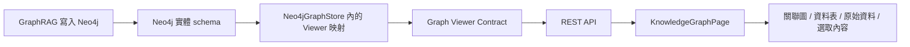

# 知識圖譜瀏覽器系統架構說明

> 適用範圍：Modern Wingman「查看知識圖譜」頁面  
> 文件日期：2026-08-02

## 1. 這個功能解決什麼問題

GraphRAG（Graph Retrieval-Augmented Generation，圖譜式檢索增強生成）會把專案內容整理成「節點」與「關係」。例如 Controller、資料表或程式方法可成為節點；CALLS、READS、WRITES 等則表示節點之間的方向性關係。

目前的知識圖譜頁面不是 GraphRAG 寫入格式的直接畫面，而是一個通用瀏覽器。後端先把 Neo4j 的實體資料轉成穩定的 **Graph Viewer Contract（圖譜瀏覽契約）**，前端只依契約顯示資料。因此未來更改節點類型、屬性名稱或關係名稱時，原則上只調整後端映射，不修改 View（檢視畫面）。

## 2. 整體資料流



各層責任如下：

| 層級 | 責任 | 不應負責 |
|---|---|---|
| GraphRAG／Neo4j | 儲存真正的節點、關係、索引與版本 | 決定畫面欄位或顏色 |
| Viewer 映射 | 套用專案及 active graph version（目前啟用的圖譜版本）、轉換節點／關係、產生分類與查詢範本 | React 畫面狀態 |
| REST API | 驗證專案狀態、提供有界查詢、回傳穩定 DTO（資料傳輸物件） | 把 Neo4j driver 物件直接交給前端 |
| 前端 View | 搜尋、篩選、繪圖、表格、Inspector（選取內容檢視器）、匯出 | 認識 `GraphEntity`、`kind`、`role` 等實體欄位 |

## 3. 目前的 Viewer Contract

### 3.1 通用節點

前端只依賴下列資料：

```json
{
  "id": "opaque-node-id",
  "labels": ["任意標籤"],
  "caption": "畫面顯示名稱",
  "category": "分類 token",
  "properties": {
    "任意欄位": "任意 JSON-safe 值"
  },
  "metrics": {
    "degree": 12
  }
}
```

- `id`：同一圖譜版本內唯一的識別碼。前端不解析其格式。
- `caption`：後端已選好的主要顯示文字。
- `category`：用於顏色與分類；可以是未來新增的任意值。
- `properties`：Inspector、資料表與原始資料共同使用的通用屬性。
- `metrics.degree`：degree（度數），即與節點相連的關係數。

舊的 `kind`、`role`、`name`、`filePath` 等 V3 相容欄位已不再輸出給 View；需要顯示的內容統一放進 `caption`、`category` 或 `properties`。

### 3.2 通用關係

```json
{
  "id": "opaque-edge-id",
  "source": "來源節點 id",
  "target": "目標節點 id",
  "type": "任意關係 token",
  "properties": {
    "evidence": "關係證據"
  }
}
```

`source` 與 `target` 保留方向；View 不把 `type` 當成固定 enum（列舉），因此可顯示未來新增的關係類型。

### 3.3 Descriptor（描述資訊）

`GET /api/projects/{id}/graph/schema` 回傳描述資訊，包括：

- `contractVersion`：Viewer Contract 版本。
- `graphRevision`：目前 active graph 的版本識別。
- `facets`：前端要產生哪些分類選單及選項。
- `captionOptions`：節點標籤可切換的顯示方式。
- `capabilities`：搜尋、鄰居、資料表、進階查詢是否可用。
- `queryTemplates`：由後端提供、符合目前實體 schema 的 Cypher 範本。
- `queryHelp`：目前 schema 的查詢規則說明。

Facet（分面篩選）中的 `id` 與 `token` 對前端是不透明值。例如前端只送出：

```json
{
  "filters": [
    { "facetId": "node-category", "tokens": ["Code"] },
    { "facetId": "edge-type", "tokens": ["READS"] }
  ]
}
```

如何把這些 token 轉成 Neo4j 條件，是後端的責任。

## 4. API 與用途

| API | 用途 |
|---|---|
| `GET /graph/schema` | 取得總數、分類、能力、標籤選項及 Cypher 範本 |
| `POST /graph/view` | 依顯示筆數與 facet filters 取得有界子圖 |
| `POST /graph/search` | 搜尋 active graph 的全部節點，不受目前畫布取樣範圍限制 |
| `POST /graph/neighbors` | 取得指定節點的一階傳入、傳出或全部鄰居 |
| `POST /graph/query` | 執行受限制的唯讀 Cypher，回傳表格與可視化資料 |

舊的 `GET /graph?kinds=...` 已移除，避免舊式 V3 參數與新 Viewer Contract 同時存在。

## 5. 一般瀏覽、搜尋與 Cypher 的差異

### 一般瀏覽

`/graph/view` 使用 bounded sampling（有界取樣），先保留能形成關係的節點，再補足顯示額度。下拉選單控制的是畫布成本，不是搜尋範圍。

### 全域搜尋

`/graph/search` 使用 Neo4j full-text index（全文索引），查詢目前專案的全部 active graph。找到節點後，再載入該節點的一階鄰域顯示，因此即使節點不在初始 1,000 筆中仍可找到。

### 進階 Cypher

Cypher 是 Neo4j 的圖形查詢語言。它直接接觸實體 schema，因此「自訂查詢文字」本身不可能跨所有 schema 永遠有效。為了讓 View 不跟著改：

- 範例與選取節點／關係的查詢範本由後端 descriptor 提供。
- View 只是一個文字編輯器與結果容器。
- schema 改版時，更新後端範本與驗證規則；不修改 React 頁面。

## 6. 未來更改 GraphRAG schema 時怎麼做

### 6.1 必須維持的契約

不論底層資料如何改，後端映射至少要保證：

1. 每個節點有唯一 `id`、可讀 `caption`、`properties`。
2. 每個關係有唯一 `id`、`source`、`target`、`type`。
3. 每條關係的兩端都出現在同一回應中。
4. 專案與 active graph revision 的限制由後端強制套用。
5. 所有 `properties` 都可安全序列化成 JSON，且敏感資料先移除。
6. 查詢與回應有明確筆數上限，並用 `truncated` 告知是否截斷。
7. 不支援的功能透過 `capabilities` 關閉。

### 6.2 後端調整步驟

當新 schema 上線時：

1. 在 `Neo4jGraphStore` 的 Viewer 映射區更新實體節點與關係的讀取方式。
2. 將新欄位映射成通用 `caption`、`category`、`labels`、`properties`。
3. 更新 descriptor 的 facets、caption options、capabilities 與 query templates。
4. 更新全域搜尋所使用的索引與可搜尋欄位。
5. 更新鄰居查詢、唯讀 Cypher scope（範圍）驗證及安全白名單。
6. 保持 REST response 的 Viewer Contract 不變。
7. 用新 schema fixture（測試資料）跑相同 contract tests，再做前端回歸。

目前為避免過度設計，V3 adapter seam（轉接邊界）仍放在 `Neo4jGraphStore` 同一檔案內，尚未拆成獨立 `IGraphViewerAdapter`。當第二種實體 schema 確定需要同時存在時，再抽出介面會比較合理。

### 6.3 具體範例

假設目前實體資料是：

```text
(:GraphEntity { id, kind: "Code", role: "controller", name })
-[:CALLS]->
(:GraphEntity { id, kind: "Code", role: "business-service", name })
```

未來改成完全不同的資料：

```text
(:Screen { key, title })-[:OPENS]->(:Endpoint { key, displayName })
(:Endpoint)-[:QUERIES]->(:DatabaseObject { key, objectType })
```

後端可以映射為：

```json
{
  "id": "screen:fund-search",
  "labels": ["Screen"],
  "caption": "基金搜尋畫面",
  "category": "user-interface",
  "properties": { "title": "基金搜尋畫面" }
}
```

並在 descriptor 發布「畫面／端點／資料庫物件」以及 `OPENS`、`QUERIES` 選項。View 仍依 `caption`、`category`、`properties`、`facets` 繪製，不需要新增 Screen 或 DatabaseObject 的前端判斷。

## 7. 安全與效能邊界

- 所有一般查詢都綁定專案與 active graph version。
- 全域搜尋最多回傳 100 筆候選。
- 畫布可選到 10,000 節點，但建議日常使用 1,000～5,000；10,000 會明顯增加傳輸、layout（版面運算）、記憶體與繪製成本。
- Cypher 只允許單一、唯讀、project/version scoped 的 MATCH 查詢，服務端自動加入結果上限。
- PNG 使用畫面主題底色與 2 倍輸出比例，最大邊長 4,096 像素。

## 8. 已知限制與後續門檻

以下不是此次清理的舊程式碼，但應在多 schema 同時運行或正式開放複雜 Cypher 前補強：

- `graphRevision` 目前由 descriptor 提供，圖資料／搜尋／鄰居回應尚未全部帶版本；未來要支援索引期間熱切換時，應讓每個 response 都帶 revision，前端拒絕混合不同版本。
- 展開鄰居目前沒有重新套用左側 facet filters；介面仍可正常探索，但應避免把篩選 chip 解讀成鄰居結果的硬限制。
- Cypher 有結果筆數上限，但尚缺獨立 transaction timeout（交易逾時）與查詢複雜度預算。
- Inspector 目前顯示前 24 個 properties；屬性很多的未來 schema 應由 descriptor 指定重要欄位或提供完整展開入口。
- 尚缺第二套完全不同 schema 的 contract fixture 與 React 元件自動化測試。

## 9. 修改與驗收檢查表

- [ ] View 原始碼沒有新增實體 label、property 或 relation 的硬編碼。
- [ ] 新節點與關係都能轉成通用 DTO。
- [ ] descriptor 的 facets 與實際查詢 mapping 一致。
- [ ] 搜尋涵蓋全部 active graph，而不是只有目前畫布。
- [ ] 關係兩端完整，不產生 orphan edge（缺端點的關係）。
- [ ] Graph、Table、Raw、Inspector 都能顯示陌生屬性。
- [ ] Cypher 範本與 query help 已由後端更新。
- [ ] typecheck、production build、後端 build 與知識圖譜測試通過。

